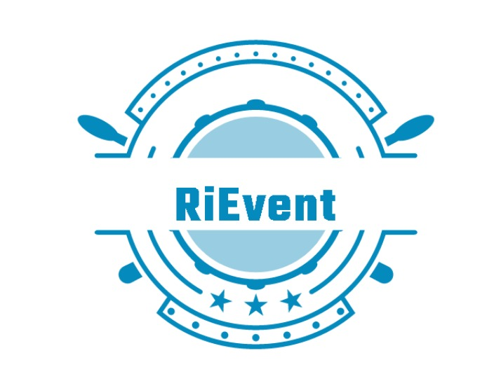

# Ri-Event App

## Introduction

This app allows you to search for events in Rijeka. Users and organizastions can also create events using this app. You can specify what type of event are you hosting, when it starts, at what location, add some image for your event etc. 

After user creates an account on registration form, he or she can then search and see what type of events they want to attend.

## Installation and setup

Backend:

- install docker and docker compose
- navigate to backend folder
- install sail 
    *  composer require laravel/sail --dev
    *  php artisan sail:install
- starting the app
    * ` ./vendor/bin/sail up `
- creatign database table:
    * `sail artisan migrate`
- seeding fake data in database:
    * `sail artisan db:seed`
    
  Frontend:
  
  - have npm installed
  - enter frontend folder
  - run this to install dependecies:
    * `npm install`
  - run this to start react app:
    * `npm start`

## Technologies used

- Laravel
- Docker
- Laravel Sail
- Laravel Sanctum
- Laravel Fortify
- React
- Material UI
